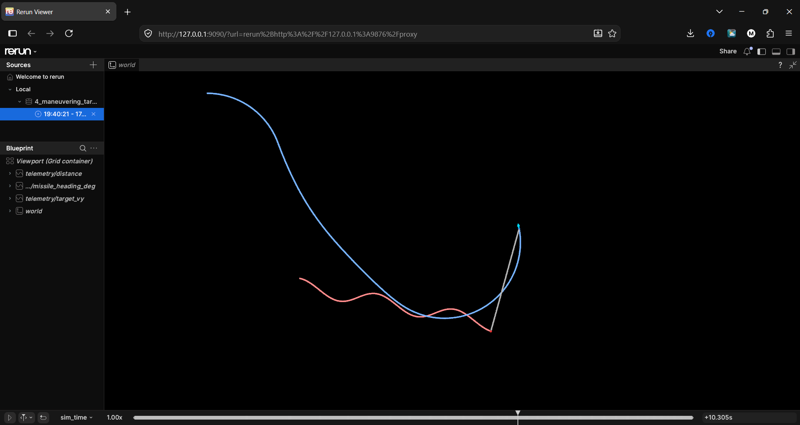

# 2D Pure Pursuit Interceptor Simulations

A lightweight aerospace simulation of **Pure Pursuit** guidance for interceptors in 2D space.

In Pure Pursuit, the interceptor steers so its velocity vector continuously aligns with the Line of Sight (LOS) to the target. The scripts in this repository were built step-by-step, gradually moving from a simple baseline to more advanced implementations.

---

## Progressive Implementations

| Stage | Script | Target Dynamics | Missile Dynamics | Key Aerospace Concept |
| :--- | :--- | :--- | :--- | :--- |
| **1** | [`fixed-target.py`](fixed-target.py) | **Stationary**<br>Fixed coordinates $(300, 400)$ | **Ideal Pure Pursuit**<br>Infinite turn rate, fixed speed ($100$) | Baseline LOS angle calculation. |
| **2** | [`moving-target.py`](moving-target.py) | **Constant Velocity**<br>Straight-line movement ($v_x=60, v_y=0$) | **Ideal Pure Pursuit**<br>Infinite turn rate, fixed speed ($150$) | Baseline LOS angle calculation. |
| **3** | [`constrained-missile.py`](constrained-missile.py) | **Constant Velocity**<br>Straight-line movement ($v_x=80, v_y=-20$) | **Constrained Turn Rate**<br>Caps turn rate to maximum possible angle, fixed speed ($200$) | Baseline LOS angle calculation with realistic turn rate limits. |
| **4** | [`maneuvering-target.py`](maneuvering-target.py) | **Evasive Maneuvers**<br>Sinusoidal motion ($v_y = 20 + 60\sin(1.5t)$) | **Constrained Turn Rate**<br>Caps turn rate to maximum possible angle, fixed speed ($250$) | Evasive maneuvers, and interception failure due to rate limits (experiencing **over-shooting** incidents). |

---

## Visualization & Telemetry (Rerun)

The simulations support live 2D telemetry visualization using [Rerun](https://rerun.io).



### Setup (Virtual Environment)
```bash
# Activate virtual environment
source venv/bin/activate

# Install Rerun SDK
pip install rerun-sdk
```

---

## How to Run

### 1. Interactive Visualization (Recommended for WSL on Windows 11)
Use the `--web` flag to open the hardware-accelerated Rerun viewer directly in your Windows browser (at `http://localhost:9090`):

```bash
# Stage 1: Fixed target
python3 fixed-target.py --web

# Stage 2: Moving target
python3 moving-target.py --web

# Stage 3: Constrained turn-rate missile
python3 constrained-missile.py --web

# Stage 4: Maneuvering target & turn-constrained missile
python3 maneuvering-target.py --web
```

> **WSL Note:** If you have WSLg enabled, omitting `--web` will launch the native desktop window. `--web` streams directly to your Windows browser without requiring X11/Wayland display setup.

### 2. Console-Only Mode
If you prefer running without visualization, you can add `--no-viz` (or run without `rerun-sdk` installed):

```bash
python3 maneuvering-target.py --no-viz
```

There are some simple tests written in each file, you can either just use them, play with their values or even make your own tests!